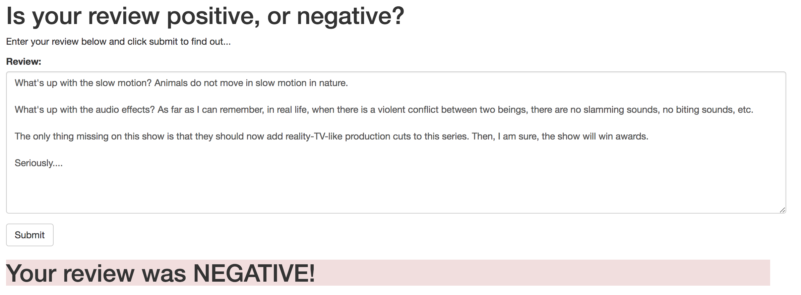

# Deploying a Sentiment Analysis Model on SageMaker Project

The project Deploying a Sentiment Analysis by Udacity inc. deploys a recurrent neural network onto AWS for the purpose of determining the sentiment of a movie review using the IMDB data set. This project repo is for educational purpose and should be used as a tool, not for copying. If viewing or using this repo, please follow the Udacity Honor Code and Community Code of Conduct: https://www.udacity.com/legal/community-guidelines

The notebook and Python files provided here, once completed, result in a simple web app which interacts with a deployed recurrent neural network performing sentiment analysis on movie reviews. This project assumes some familiarity with SageMaker, the IMDB Sentiment Analysis using XGBoost mini-project should provide enough background.

Please see the [README](https://github.com/udacity/sagemaker-deployment/tree/master/README.md) in the root directory for instructions on setting up a SageMaker notebook and downloading the project files (as well as the other notebooks).

